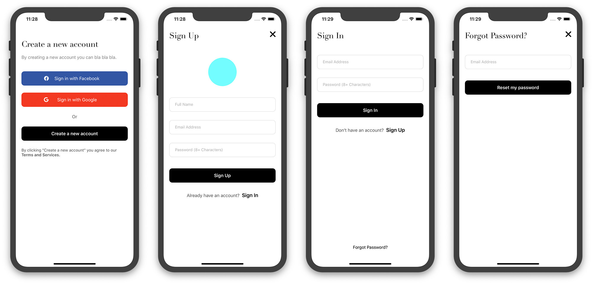

# Simple iOS App Named: *Firebase-Register*
This is *practise project* for iOS app development course.

__What I have learned here:__
1. Integration of *Firebase* with ios application,
2. Ugase of realtime database,
3. Ugase of FireStore storage,
4. Ugase of different types of authentication,
5. Debugging firebase connection errors,
6. and many more...

___
__Screenshot:__

__Video:__

